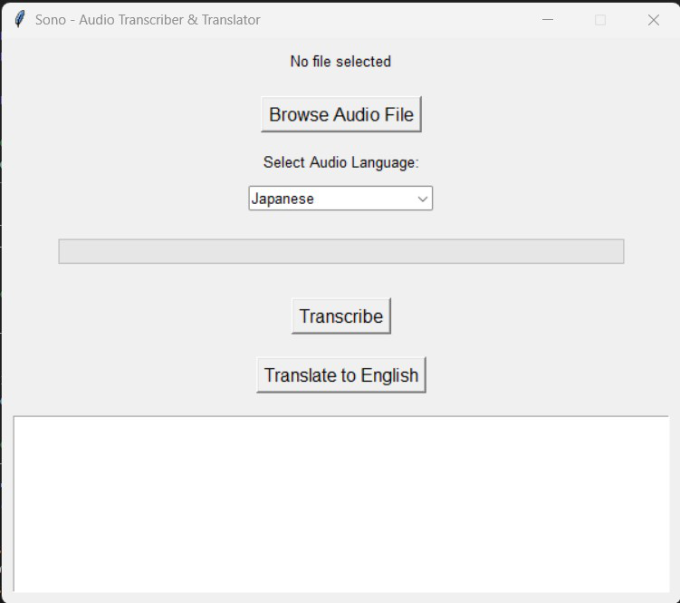

# **Sono - Audio Transcriber & Translator**

 

**Sono** is a lightweight, user-friendly desktop application designed to transcribe and translate audio files into text. Built using OpenAI's powerful **Whisper** library and Python's **Tkinter** framework, Sono provides an intuitive graphical interface for seamless transcription and translation tasks. Whether you're working with Japanese, Spanish, French, or any other supported language, Sono makes it easy to convert audio content into written form.

---

## **Features**

Sono offers a range of features to streamline your audio processing workflow:

- **Transcription**: Automatically transcribe audio files into their original language.
- **Translation**: Translate non-English audio into English with a single click.
- **Language Selection**: Choose from a dropdown menu of supported languages for accurate transcription and translation.
- **Progress Bar**: Visualize the progress of transcription and translation tasks in real-time.
- **Lightweight**: Runs locally on your machine without requiring an internet connection (except for initial setup).
- **Cross-Platform**: Compatible with Windows, macOS, and Linux.
- **User-Friendly GUI**: A clean and intuitive interface ensures ease of use for all users.

---

## **Supported Languages**

Sono supports the following languages:

- **English** (`en`)
- **Japanese** (`ja`)
- **Spanish** (`es`)
- **French** (`fr`)
- **German** (`de`)
- **Chinese** (`zh`)
- **Hindi** (`hi`)
- **Korean** (`ko`)
- **Russian** (`ru`)
- **Italian** (`it`)
- **Portuguese** (`pt`)

*More languages can be added based on user feedback.*

---

## **Installation**

### **Prerequisites**

Before installing and running Sono, ensure you have the following installed on your system:

- **Python 3.8 or higher**: Download Python from [python.org](https://www.python.org/downloads/).
- **FFmpeg**: Required for processing audio files. Download FFmpeg from [https://ffmpeg.org](https://ffmpeg.org) and add it to your system PATH.
- **Git** (optional): For cloning the repository.

### **Steps to Install**

1. **Clone the Repository**:
   ```bash
   git clone https://github.com/oTnarP/Sono.git
   cd Sono
   ```

2. **Set Up a Virtual Environment** (Optional but Recommended):
   ```bash
   python -m venv venv
   ```

   - Activate the virtual environment:
     - On **Windows**:
       ```bash
       venv\Scripts\activate
       ```
     - On **macOS/Linux**:
       ```bash
       source venv/bin/activate
       ```

3. **Install Dependencies**:
   ```bash
   pip install -r requirements.txt
   ```

4. **Verify FFmpeg Installation**:
   Ensure FFmpeg is installed and accessible by running:
   ```bash
   ffmpeg -version
   ```

   If this command fails, refer to the [FFmpeg installation guide](https://ffmpeg.org/download.html).

---

## **Usage**

1. **Run the Application**:
   After completing the installation steps, run the application using:
   ```bash
   python transcribe.py
   ```

2. **Using the GUI**:
   - **Step 1**: Click **Browse Audio File** to select an audio file (MP3, WAV, etc.).
   - **Step 2**: Select the audio language from the dropdown menu.
   - **Step 3**: Click **Transcribe** to transcribe the audio in its original language.
   - **Step 4**: Click **Translate to English** to translate the audio into English.

3. **View Results**:
   The transcribed or translated text will appear in the textbox below the buttons.

---

## **Screenshots**

Here’s a preview of the Sono interface:



---

## **Contributing**

We welcome contributions from the community! If you'd like to contribute to Sono, follow these steps:

1. **Fork the Repository**:
   Click the "Fork" button on the top-right corner of this repository.

2. **Create a New Branch**:
   Create a new branch for your feature or bug fix:
   ```bash
   git checkout -b feature-name
   ```

3. **Commit Your Changes**:
   Commit your changes with a descriptive message:
   ```bash
   git commit -m "Add feature or fix"
   ```

4. **Push Your Changes**:
   Push your changes to GitHub:
   ```bash
   git push origin feature-name
   ```

5. **Open a Pull Request**:
   Open a pull request on the main repository, describing your changes and why they should be merged.

---

## **Credits**

Sono would not have been possible without the following open-source tools and libraries:

- **Whisper**: This project uses OpenAI's Whisper library for transcription and translation. Learn more: [Whisper GitHub](https://github.com/openai/whisper)
- **Tkinter**: The GUI framework used for building the application.
- **FFmpeg**: Used for audio processing.

---

## **License**

This project is free to use and does not require a license. Feel free to modify and distribute it as needed.

---

## **Contact**

If you have any questions, suggestions, or feedback, feel free to reach out:

- **Email**: support@leadniaga.com
- **GitHub**: [@oTnarP](https://github.com/oTnarP)

---

## **Acknowledgments**

Special thanks to the developers of OpenAI's Whisper and the open-source community for making tools like this possible. Your contributions inspire projects like Sono!

---

## **Future Enhancements**

Here are some potential future improvements for Sono:

- **Batch Processing**: Add support for transcribing and translating multiple audio files at once.
- **Custom Translation Targets**: Allow users to translate audio into languages other than English.
- **Improved Progress Tracking**: Provide real-time progress updates during transcription and translation.
- **Export Options**: Enable exporting transcriptions and translations to text files or other formats.
